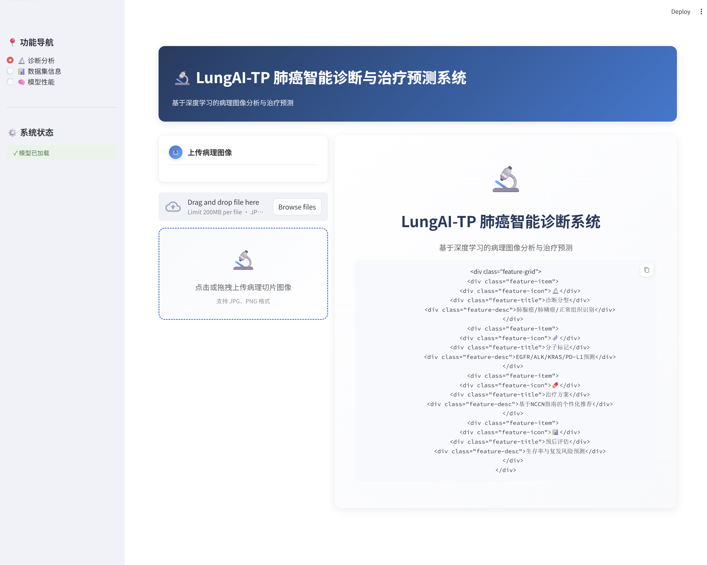
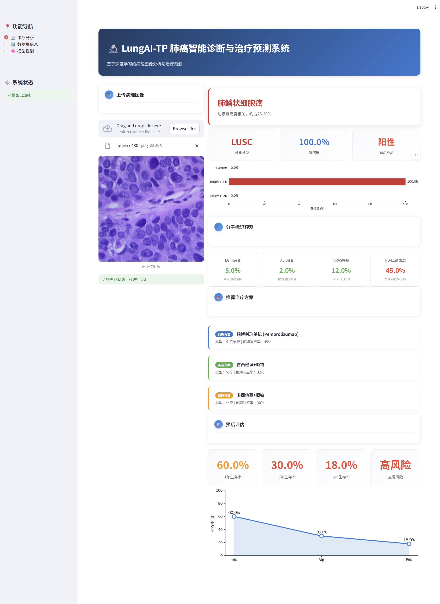
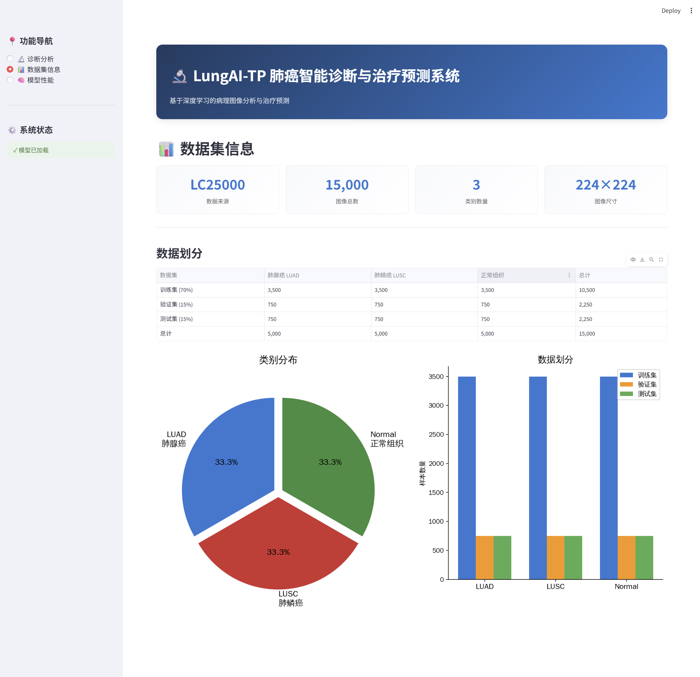
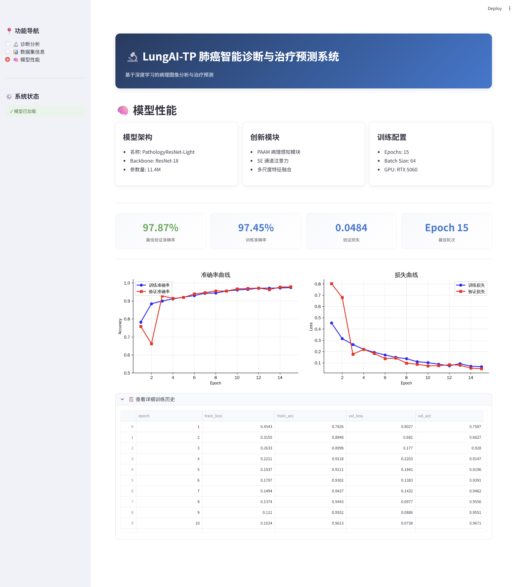

# LungAI-TP 肺癌智能诊断与治疗预测系统

[](https://www.python.org/)
[](https://pytorch.org/)
[](LICENSE)

## 项目简介

LungAI-TP 是一个基于深度学习的肺癌病理诊断与治疗预测系统。系统能够从病理切片图像中自动识别肺癌类型，并提供治疗方案建议和预后评估。

### 主要功能

| 功能 | 说明 |
|------|------|
| 诊断分型 | 识别肺腺癌/肺鳞癌/正常组织 |
| 分子标记 | 预测EGFR/ALK/KRAS/PD-L1状态 |
| 治疗方案 | 基于NCCN指南的个性化推荐 |
| 预后评估 | 生存率与复发风险预测 |

---

## 系统架构

```
病理图像输入
    ↓
[图像预处理与特征增强]
    ↓
[ResNet-18 特征提取]
    ↓
[分类输出: LUAD / LUSC / Normal]
    ↓
[知识推理引擎]
    ├─ 分子标记预测
    ├─ 治疗方案推荐
    └─ 预后评估
```

---

## 数据集

**LC25000 公开数据集**

| 类别 | 数量 |
|------|------|
| 肺腺癌 (LUAD) | 5,000 |
| 肺鳞癌 (LUSC) | 5,000 |
| 正常组织 | 5,000 |
| **总计** | **15,000** |

### 数据划分

| 数据集 | 比例 | 每类数量 | 总计 |
|--------|------|---------|------|
| 训练集 | 70% | 3,500 | 10,500 |
| 验证集 | 15% | 750 | 2,250 |
| 测试集 | 15% | 750 | 2,250 |

---

## 模型性能

| 指标 | 结果 |
|------|------|
| 模型 | PathologyResNet-Light |
| 参数量 | 11.4M |
| 训练准确率 | 97.4% |
| 验证准确率 | 97.9% |
| 训练时间 | ~5分钟 (RTX 5060) |

---

## 界面展示

### 主界面

上传病理图像即可开始诊断，系统自动分析并返回完整报告。



### 诊断结果

显示诊断分型、置信度、分子标记预测、治疗方案推荐和预后评估。



### 数据集信息

展示LC25000数据集的划分情况和类别分布。



### 模型性能

展示训练准确率曲线、损失曲线等性能指标。



---

## 安装与使用

### 环境要求

- Python 3.12+
- PyTorch 2.0+
- CUDA 11.8+ (可选，用于GPU加速)

### 安装步骤

```bash
# 1. 克隆项目
git clone https://github.com/your-username/LungAI-TP.git
cd LungAI-TP

# 2. 创建虚拟环境
python -m venv lungai-tp-env
source lungai-tp-env/bin/activate  # Linux/Mac
# 或
lungai-tp-env\Scripts\activate  # Windows

# 3. 安装依赖
pip install torch torchvision streamlit matplotlib pandas scikit-learn pillow
```

### 快速开始

```bash
# 启动Web界面
streamlit run app.py

# 访问地址
http://localhost:8501
```

### 训练模型

```bash
# 准备数据
python data/prepare_data_with_test.py

# 训练模型
python train_pathology.py --light --epochs 15 --batch_size 64
```

---

## 项目结构

```
LungAI-TP/
├── app.py                    # Web界面
├── models/
│   └── pathology_resnet.py   # 模型定义
├── knowledge_reasoner.py     # 知识推理模块
├── config.py                 # 配置文件
├── train_pathology.py        # 训练脚本
├── data/
│   ├── raw/                  # 原始数据
│   ├── train/                # 训练集
│   ├── val/                  # 验证集
│   └── test/                 # 测试集
└── results/                  # 训练结果
```

---

## 技术细节

### 知识数据来源

| 模块 | 数据来源 |
|------|---------|
| 分子标记 | TCGA Pan-Lung Cancer |
| 治疗响应 | FLAURA, KEYNOTE等临床试验 |
| 治疗方案 | NCCN Guidelines 2024 |
| 预后评估 | SEER Database |

---

## 许可证

本项目采用 MIT 许可证。
